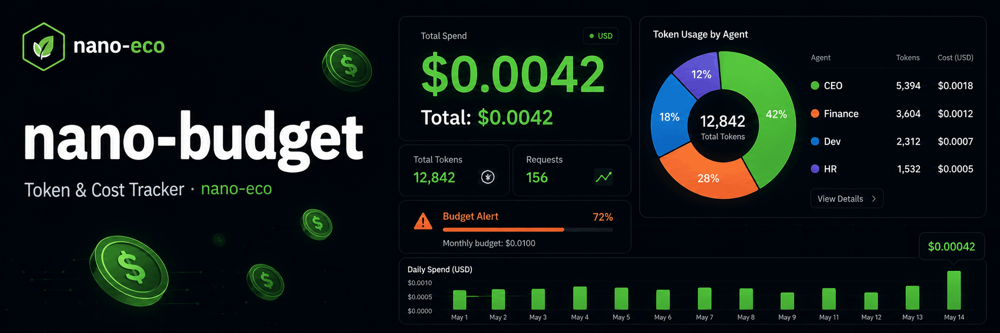

<p align="center">
  
</p>

<h1 align="center">nano-budget</h1>

<p align="center">
  <strong>Token & cost tracker for nano-eco — aggregate spending across every agent, tool, and component</strong><br/>
  One place to see exactly how much every AI action costs. Set limits. Never get surprised.
</p>

<p align="center">
  
  
  
  
</p>

---

## The Problem

When running a multi-agent system, costs come from everywhere:

- CEO agent calling Claude Opus
- Finance agent calling Groq
- Tools triggering extra LLM calls
- Eval running 50 test cases
- Memory retrieval with embeddings

Without a central tracker, you have no idea what your system actually costs — until you get the API bill.

---

## The Solution

**nano-budget** is the cost brain of nano-eco. Every component calls `budget.record()` after each LLM call. nano-budget aggregates it all into one SQLite store and gives you full drill-down: by source, by agent, by model, by session.

```python
from nano_budget import Budget

budget = Budget()

# Every nano-eco component records here
budget.record("nano-agent", input_tokens=1500, output_tokens=800,
              model="claude-opus-4-7", provider="anthropic", agent_id="ceo")

budget.record("nano-tools", input_tokens=200, output_tokens=50,
              model="groq/llama3", provider="groq", agent_id="finance")

budget.record("nano-eval",  input_tokens=5000, output_tokens=2000,
              model="gpt-4o-mini", provider="openai")

# See total across everything
t = budget.total()
print(f"Total: ${t['cost_usd']:.6f} | {t['total_tokens']:,} tokens | {t['calls']} calls")
# Total: $0.023150 | 9550 tokens | 3 calls
```

---

## Installation

```bash
pip install nano-budget
```

---

## Usage

### Record usage from any component

```python
from nano_budget import Budget

budget = Budget()  # stored at ~/.nano-budget/budget.db

# From nano-agent
budget.record(
    source       = "nano-agent",
    input_tokens = 1500,
    output_tokens= 800,
    model        = "claude-opus-4-7",
    provider     = "anthropic",
    agent_id     = "ceo",
    session_id   = "session_abc",
)

# From nano-tools (tool triggered LLM)
budget.record("nano-tools", input_tokens=200, output_tokens=50,
              model="gpt-4o-mini", provider="openai", agent_id="dev")

# From nano-eval (batch evaluation)
budget.record("nano-eval", input_tokens=10000, output_tokens=3000,
              model="claude-haiku-4-5-20251001", provider="anthropic")

# From nano-flow (pipeline execution)
budget.record("nano-flow", input_tokens=300, output_tokens=150,
              model="groq/llama3", provider="groq", session_id="session_abc")
```

### Total spending

```python
# All time
t = budget.total()
print(f"${t['cost_usd']:.6f} | {t['total_tokens']:,} tokens | {t['calls']} calls")

# Today only
today = budget.today()

# By session
s = budget.session("session_abc")

# By agent
a = budget.agent("ceo")
```

### Breakdown drill-down

```python
# By source (which component spent what)
for row in budget.by_source():
    print(f"{row['source']:20} ${row['cost_usd']:.6f}  {row['calls']} calls")
# nano-agent            $0.018500  12 calls
# nano-tools            $0.002100   8 calls
# nano-eval             $0.001800   3 calls
# nano-flow             $0.000750   5 calls

# By agent
for row in budget.by_agent():
    print(f"{row['agent_id']:15} ${row['cost_usd']:.6f}")
# ceo             $0.015200
# finance         $0.004100
# dev             $0.001800

# By model
for row in budget.by_model():
    print(f"{row['model']:35} ${row['cost_usd']:.6f}")
# claude-opus-4-7                     $0.012500
# claude-haiku-4-5-20251001           $0.004200
# gpt-4o-mini                         $0.002300
# llama-3.3-70b-versatile             $0.000150
```

### Budget limits — hard stop when exceeded

```python
# Set global limit
budget.set_limit("global", limit_usd=5.00, alert_at=0.8)

# Per-agent limit
budget.set_limit("agent:ceo", limit_usd=2.00)

# Per-session limit
budget.set_limit("session:demo_run", limit_usd=0.50, limit_tokens=100_000)

# Now any record() call that pushes over the limit raises:
# BudgetExceededError: Budget exceeded for 'agent:ceo': $2.003 / $2.000
```

```python
from nano_budget import BudgetExceededError

try:
    budget.record("nano-agent", input_tokens=50000, output_tokens=20000,
                  model="claude-opus-4-7", agent_id="ceo")
except BudgetExceededError as e:
    print(f"STOP: {e.scope} exceeded ${e.limit:.2f} (used ${e.used:.4f})")
    # Fallback to cheaper model
```

### Check remaining budget

```python
r = budget.remaining("agent:ceo")
print(f"Used: ${r['used_usd']:.4f} / ${r['limit_usd']:.2f} ({r['pct_used']}%)")
print(f"Left: ${r['remaining_usd']:.4f}")
```

### Estimate cost before calling

```python
from nano_budget import Budget, estimate_cost

# Quick estimate — no LLM call needed
cost = Budget.estimate("claude-opus-4-7", input_tokens=2000, output_tokens=800)
print(f"Estimated: ${cost:.6f}")  # $0.090000

# Compare models for same task
models = ["claude-opus-4-7", "claude-haiku-4-5-20251001", "gpt-4o-mini", "llama-3.3-70b-versatile"]
for m in models:
    c = estimate_cost(m, 2000, 800)
    print(f"  {m:40} ${c:.6f}")
# claude-opus-4-7                          $0.090000
# claude-haiku-4-5-20251001                $0.004800
# gpt-4o-mini                              $0.000780
# llama-3.3-70b-versatile                  $0.001810
```

---

## Pricing Table

25+ models across 10 providers — updated May 2026:

| Provider | Model | Input $/1M | Output $/1M |
|---------|-------|-----------|------------|
| Anthropic | claude-opus-4-7 | $15.00 | $75.00 |
| Anthropic | claude-haiku-4-5 | $0.80 | $4.00 |
| OpenAI | gpt-4o | $2.50 | $10.00 |
| OpenAI | gpt-4o-mini | $0.15 | $0.60 |
| Groq | llama-3.3-70b-versatile | $0.59 | $0.79 |
| Gemini | gemini-2.0-flash | $0.075 | $0.30 |
| Mistral | mistral-small-latest | $0.20 | $0.60 |
| Ollama | llama3.2 (local) | $0.00 | $0.00 |
| OpenRouter | llama-3.1-8b:free | $0.00 | $0.00 |

---

## CLI Reference

```bash
# Total spending
nano-budget stats
nano-budget stats --today

# Breakdown by source/agent/model
nano-budget breakdown --by source
nano-budget breakdown --by agent --today
nano-budget breakdown --by model

# Estimate cost
nano-budget estimate claude-opus-4-7 --in 2000 --out 800

# Set limits
nano-budget limit global --usd 10.00 --alert 0.8
nano-budget limit agent:ceo --usd 2.00
nano-budget limit session:demo --tokens 100000

# Check remaining
nano-budget remaining global
nano-budget remaining agent:ceo
```

---

## Architecture

```
nano_budget/
├── budget.py      # Budget class — record(), total(), by_source(), set_limit()
├── pricing.py     # PRICING dict (25+ models), estimate_cost()
└── store/
    └── sqlite.py  # BudgetStore — WAL SQLite, indexed queries
```

**How it integrates with nano-eco:**

```
nano-agent  ─┐
nano-tools  ─┤
nano-eval   ─┼─► budget.record(source, tokens, model, agent_id) ─► SQLite
nano-flow   ─┤
nano-memory ─┘

budget.total()      → sum all
budget.by_source()  → per component
budget.by_agent()   → per agent
budget.remaining()  → vs limit
```

---

## nano-eco Ecosystem

| Project | Role |
|---------|------|
| [nano-proxy](https://github.com/ghanibot/nano-proxy) | LLM routing |
| [nano-log](https://github.com/ghanibot/nano-log) | Call observability |
| [nano-guard](https://github.com/ghanibot/nano-guard) | Guardrails |
| [nano-agent](https://github.com/ghanibot/nano-agent) | AI agents |
| [nano-tools](https://github.com/ghanibot/nano-tools) | Tool execution |
| [nano-eval](https://github.com/ghanibot/nano-eval) | Evaluation |
| [nano-flow](https://github.com/ghanibot/nano-flow) | Workflow pipelines |
| **nano-budget** | Cost tracking ← you are here |

---

## License

MIT © [ghanibot](https://github.com/ghanibot)
